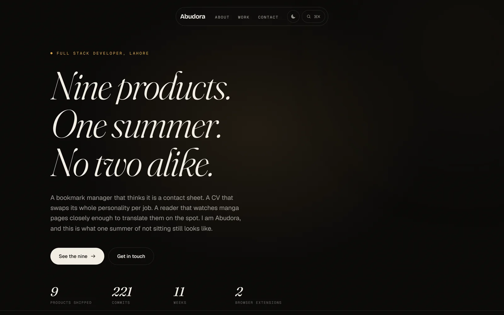
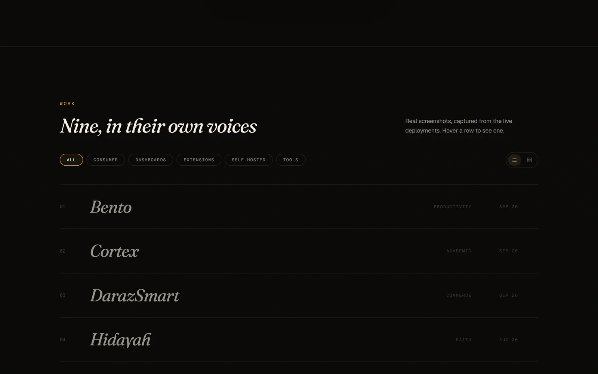
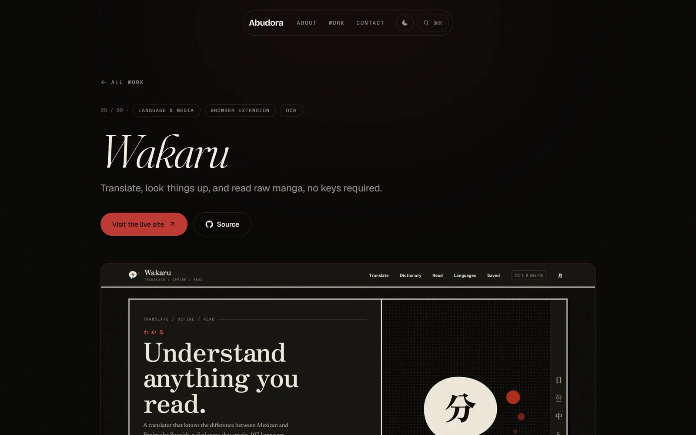
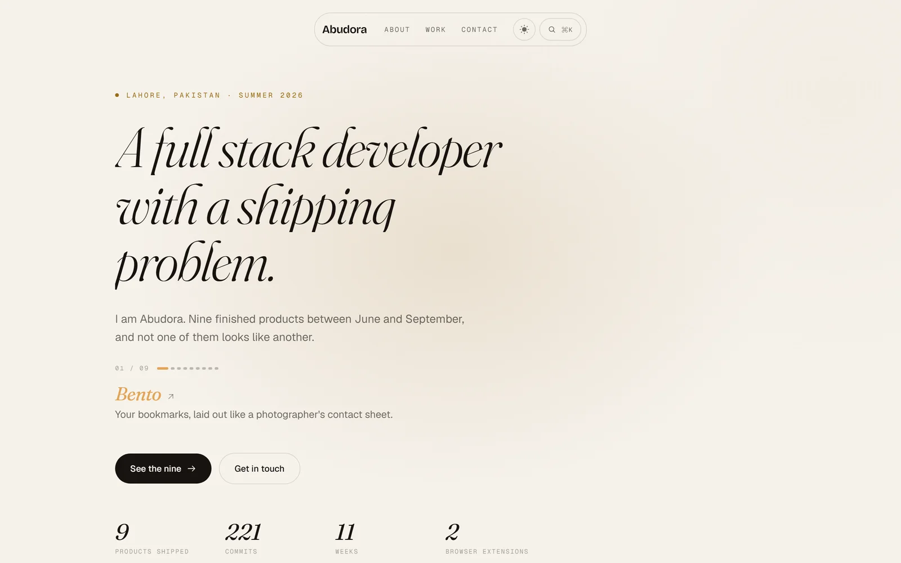

<div align="center">

# Abudora

### Nine products. One summer. No two alike.

A portfolio that refuses to show nine things the same way. Every project carries
its own accent colour through the interface, and every screenshot on it was
captured from the live deployment by a script in this repo.

[](https://nextjs.org)
[](https://react.dev)
[](https://typescriptlang.org)
[](https://tailwindcss.com)
[](https://motion.dev)
[](LICENSE)



</div>

---

## What this is

The nine products below were designed, built and deployed between June and
September 2026. This site is how they get shown: not a grid of identical cards,
but an editorial index where hovering a row floats that product's real
screenshot beside your cursor and repaints the entire page in its colour.

## The nine

| # | Project | What it does | Live | Source |
|---|---------|--------------|------|--------|
| 01 | **Bento** | A self hosted bookmark manager that lays saved pages out as a photographic contact sheet | [bentto.vercel.app](https://bentto.vercel.app) | [repo](https://github.com/Abudora-0/Bento) |
| 02 | **Cortex** | An academic dashboard for UET Lahore: GPA, timetable, attendance, LMS sync | [cortexlms.vercel.app](https://cortexlms.vercel.app) | [repo](https://github.com/Abudora-0/Cortex) |
| 03 | **DarazSmart** | Price comparison, drop alerts and coupon collection for Daraz.pk | [darazsmart.vercel.app](https://darazsmart.vercel.app) | [repo](https://github.com/Abudora-0/darazsmart) |
| 04 | **Hidayah** | Prayer times, Hijri calendar and the full Quran, computed on device and usable offline | [hidayyah.vercel.app](https://hidayyah.vercel.app) | [repo](https://github.com/Abudora-0/Hidayah) |
| 05 | **Morphly** | Turns pasted text or AI output into genuine .docx, .xlsx and .pptx files | [morphlyy.vercel.app](https://morphlyy.vercel.app) | [repo](https://github.com/Abudora-0/Morphly) |
| 06 | **OmniKit** | A self hostable kit of image, PDF and utility tools that never touch disk | [omniikit.vercel.app](https://omniikit.vercel.app) | [repo](https://github.com/Abudora-0/omnikit) |
| 07 | **Preface** | Turns a pasted project dump into a structured, accurate README | [prefacee.vercel.app](https://prefacee.vercel.app) | [repo](https://github.com/Abudora-0/Preface) |
| 08 | **Roleify** | A CV builder that re themes its entire interface to match your profession | [roleify.vercel.app](https://roleify.vercel.app) | [repo](https://github.com/Abudora-0/roleify) |
| 09 | **Wakaru** | Translator, 107 language dictionary and manga OCR reader on keyless APIs | [wakaruu.vercel.app](https://wakaruu.vercel.app) | [repo](https://github.com/Abudora-0/Wakaru) |

## Features

**Accent bleed.** Each project owns one hex. Hovering its row, or opening its
page, sets `--accent` on the document root, and every tint in the interface is
mixed from it at paint time with `color-mix`. One colour per project drives both
themes, with no second hand picked value to keep in sync.

**An index, not a grid.** Nine oversized numbered rows. Hover one and the real
screenshot floats in beside the pointer on a spring, tilted slightly, clamped so
it never slides off screen. A segmented control flips the whole thing into a
contact sheet of all nine captures.

**Real screenshots.** Twenty one of them, taken from the live deployments by
`npm run shots` rather than mocked up. See [capturing screenshots](#capturing-screenshots).

**Light and dark.** A full second palette, not an inversion, applied before
first paint by a blocking inline script so the page never flashes the wrong
theme.

**Keyboard first.** `⌘K` opens a palette with project thumbnails and direct
links to every live site. `?` lists every shortcut. `T` flips the theme. `G`
then `W`, `A` or `C` jumps between sections.

**Details.** Scroll linked word by word reveals, a live Lahore clock with a
context aware status line, a gantt of the real commit history of all nine
projects, count ups driven from the data rather than typed in, a fullscreen
screenshot viewer with arrow key navigation, a scroll progress ring in the
navigation, and `prefers-reduced-motion` honoured throughout.

<div align="center">







</div>

## Built with

| | |
|---|---|
| Framework | Next.js 16, App Router, fully static |
| Language | TypeScript, strict |
| Styling | Tailwind CSS v4, CSS first with `@theme` |
| Motion | Framer Motion |
| Icons | simple-icons for brand marks, hand drawn SVG for the interface |
| Type | Fraunces, Bricolage Grotesque, Geist, Geist Mono |
| Capture | playwright-core plus sharp |

## Getting started

```bash
npm install
npm run dev
```

The dev server runs on port 3210. Build with `npm run build`, then `npm start`.

## Capturing screenshots

Every image of the nine projects is generated, never pasted in by hand, so the
site can be brought back in line with reality by rerunning one command.

```bash
npm run shots            # all nine
npm run shots -- wakaru  # just one
```

The script uses `playwright-core`, which ships no browser of its own, and hunts
for a Chromium already on the machine. Set `CHROME_PATH` if it cannot find one.
Shots are taken at 1440x900 on a 2x device pixel ratio, well after
`networkidle` so entrance animations have finished, then converted to WebP.
Scrollbars are hidden and the colour profile is pinned to sRGB, so the accents
the site reads from these images stay accurate.

Two of the nine sit behind a sign in wall, so only their public pages are
captured. Nothing in this repo signs in as anybody.

## Structure

```
src/
  app/
    page.tsx              hero, about, work, contact, footer
    work/[slug]/page.tsx  one static page per project
    icon.svg              monogram favicon
    opengraph-image.tsx   generated social card
  components/             one file per section or behaviour
  data/projects.ts        single source of truth for all nine
scripts/
  capture.mjs             screenshots the nine live sites
  capture-self.mjs        screenshots this site for this readme
public/shots/             the captures themselves
```

`src/data/projects.ts` is the only place project facts live. Ship dates and
commit counts in it came from each repository's git history, and the stat
figures on the site are computed from that array rather than written down.

## Contact

Muhammad Abdullah, Lahore, Pakistan.

[GitHub](https://github.com/Abudora-0) ·
[LinkedIn](https://www.linkedin.com/in/m-abdullah-94367b3a1/) ·
[m.abdullah21306@gmail.com](mailto:m.abdullah21306@gmail.com)

## License

[MIT](LICENSE), Muhammad Abdullah.
